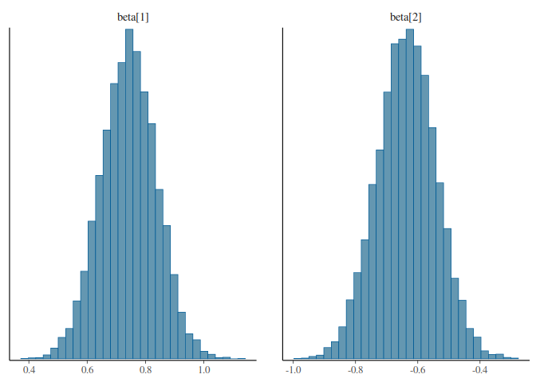
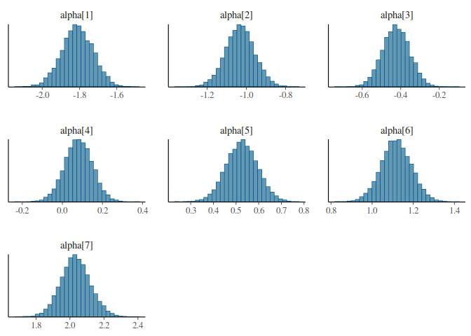
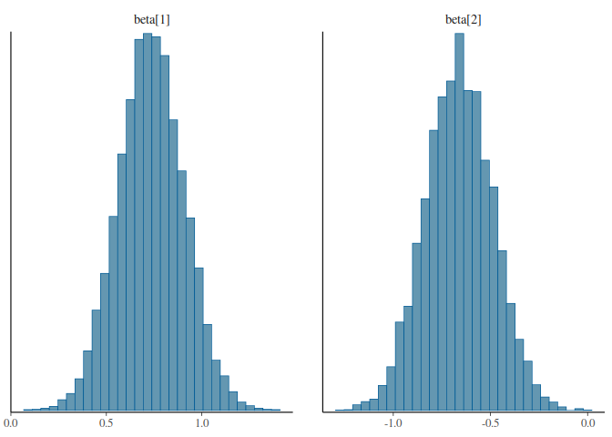
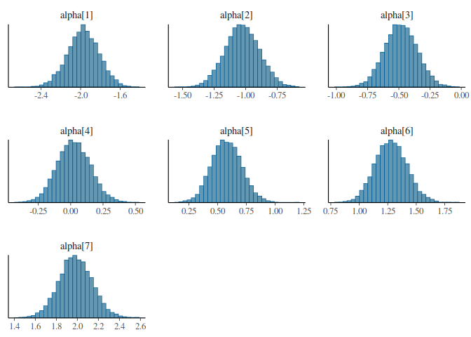

# Model

Let *Y*<sub>*i*</sub> ∈ {1, ..., 8} be the day 14 outcome for
participant *i* where 1 is best and 8 is worst (death). Let
*τ*<sub>*i*</sub> ∈ {1, 2, 3} denote treatment arm and *x*<sub>*i*</sub>
the corresponding design encoding. For the (reduced) primary model we
specify
ℙ\[*Y*<sub>*i*</sub> ≤ *k*\|*α*, *β*; *x*<sub>*i*</sub>\] = logit<sup> − 1</sup>(*α*<sub>*k*</sub> + *x*<sub>*i*</sub><sup>T</sup>*β*),  *i* = 1, 2, ..., *k* = 1, ..., 7,
where {*α*<sub>*k*</sub>} is increasing in *k* and
*β* = (*β*<sub>1</sub>, *β*<sub>2</sub>)<sup>T</sup> represent the
cumulative log-odds ratio of treatments 2 and 3 relative to 1.

Define the outcome level probabilities in the control group by
*π*<sub>*k*</sub> = ℙ\[*Y* = *k*\|*α*\], for *k* = 1, ..., 8 where
$$
\\pi_k = \\begin{cases}
1 - \\text{logit}^{-1}(\\alpha_1) & \\text{if }k=1 \\\\
\\text{logit}^{-1}(\\alpha\_{k-1}) - \\text{logit}^{-1}(\\alpha_k) & \\text{if }k\\in\\{2,...,7\\}\\\\
\\text{logit}^{-1}(\\alpha\_{7}) & \\text{if } k=8
\\end{cases}
$$

We specify the priors on the level probabilities as Dirichlet on the
simplex,
*π* ∼ Dirichlet(*κ*)
for some *κ* = (*κ*<sub>1</sub>, ..., *κ*<sub>8</sub>) where the sum
∑*κ*<sub>*k*</sub> gives the concentration. For uninformative we would
usually choose something like ∑*κ*<sub>*k*</sub> = 1.

For the coefficients we specify
*β* ∼ Normal(0, *σ*<sub>*β*</sub>)
for some chosen value *σ*<sub>*β*</sub>.

# Stan code

Given that we will only be simulating discrete covariates, we can
collapse the model by covariate pattern. E.g. rather than model
*Y*<sub>*i*</sub> ∈ {1, ..., 8} for *i* = 1, ..., *n* we can collapse
into *J* covariate patterns and model *Y*<sub>*j*</sub> ∈ {1, ..., 8}
weighted by *n*<sub>*j*</sub> with
∑<sub>*j*</sub>*n*<sub>*j*</sub> = *n*.

Note, in the following code `prior_counts` corresponds to *κ*, and
`prior_sd` to *σ*<sub>*β*</sub> in the above. Also `c` corresponds to
*α*.

## Per-participant implementation

``` r
writeLines(readLines("../stan/ordmod.stan"))
```

    ## functions {
    ##   vector make_cutpoints(vector p, real scale) {
    ##     int C = rows(p) - 1;
    ##     vector[C] cutpoints;
    ##     real running_sum = 0;
    ##     for(c in 1:C) {
    ##       running_sum += p[c];
    ##       cutpoints[c] = logit(running_sum);
    ##     }
    ##     return scale * cutpoints;
    ##   }
    ## }
    ## 
    ## data {
    ##   int N; // number of records
    ##   int K; // number of response levels
    ##   int P; // number of covariates
    ##   int<lower=1,upper=K> y[N];
    ##   matrix[N, P] X; // design matrix
    ##   vector[K] prior_counts; // prior for Dirichlet on cuts
    ##   vector[P] prior_sd; // prior SD for beta coefficients
    ## }
    ## 
    ## parameters {
    ##   simplex[K] pi;    // category probabilities
    ##   vector[P] beta_raw;   // covariate coefficients
    ## }
    ## 
    ## transformed parameters {
    ##   vector[K-1] c; // cut-points on unconstrained scale
    ##   vector[P] beta = prior_sd .* beta_raw;
    ##   c = make_cutpoints(pi, 1);
    ## }
    ## 
    ## model {
    ##   // Linear predictor
    ##   vector[N] eta = X * beta;
    ## 
    ##   // Prior model
    ##   pi ~ dirichlet(prior_counts);
    ##   beta_raw ~ normal(0, 1);
    ## 
    ##   // Observational model
    ##   y ~ ordered_logistic(eta, c);
    ## }
    ## 
    ## generated quantities {
    ##   int<lower=1, upper=K> y_ppc[N];
    ##   // posterior predictive draws
    ##   for (n in 1:N)
    ##     y_ppc[n] = ordered_logistic_rng(X[n]*beta, c);
    ## }

## Per-pattern implementation

``` r
writeLines(readLines("../stan/ordmodagg.stan"))
```

    ## // James Totterdell
    ## // Date: 2021-10-13
    ## //
    ## // if undertaking simulations we would generally not have
    ## // any continuous covariates, but instead just discrete treatment groups
    ## // Therefore, to save computation time we can aggregate over
    ## // the covariate patterns and weight by counts.
    ## // E.g. rather than analyse N = 2,100 participants 1:1:1 to 3 arms,
    ## // We can analyse the 3 covariate patterns weighted by sample size.
    ## 
    ## functions {
    ##   // calculate the multinomial coefficient
    ##   // required if want to include constants in log likelihood evaluation
    ##   // - y: observed counts
    ##   real multinomial_coef(vector y) {
    ##     return lgamma(sum(y) + 1) - sum(lgamma(y + 1));
    ##   }
    ## 
    ##   // make_cutpoints
    ##   // - p: outcome level probabilities
    ##   vector make_cutpoints(vector p, real scale) {
    ##     int C = rows(p) - 1;
    ##     vector[C] cutpoints;
    ##     real running_sum = 0;
    ##     for(c in 1:C) {
    ##       running_sum += p[c];
    ##       cutpoints[c] = logit(running_sum);
    ##     }
    ##     return scale * cutpoints;
    ##   }
    ## 
    ##   // Pr(y == k) for k=1,...,K
    ##   // - c: cut-points for outcome levels
    ##   // - eta: linear predictor for each pattern
    ##   matrix Pr(vector c, vector eta) {
    ##     int N = num_elements(eta);
    ##     int K = num_elements(c) + 1;
    ##     matrix[N, K] out;
    ##     // for stability, work on log-scale
    ##     for (n in 1:N) {
    ##       out[n, 1] = log1m_exp(-log1p_exp(-(eta[n] - c[1]))); // ln(1 - inv_logit(eta[n] - c[1]))
    ##       out[n, K] = -log1p_exp(-(eta[n] - c[K-1]));          // ln(inv_logit(eta[n] - c[K-1]))
    ##       for (k in 2:(K - 1)) {
    ##         // ln(inv_logit(eta[n] - c[k-1]) - inv_logit(eta[n] - c[k]))
    ##         out[n, k] = log_diff_exp(-log1p_exp(-(eta[n] - c[k-1])), -log1p_exp(-(eta[n] - c[k])));
    ##       }
    ##     }
    ##     return exp(out);
    ##   }
    ## 
    ##   // log-likelihood (multinomial)
    ##   // - p: level probabilities for each pattern
    ##   // - y: observed count for each level for each pattern
    ##   vector log_lik(matrix p, matrix y) {
    ##     int N = rows(y);
    ##     int K = cols(y);
    ##     vector[N] out;
    ##     for(n in 1:N) {
    ##       out[n] = 0.0;
    ##       for(k in 1:K) {
    ##         out[n] += y[n, k] * log(p[n, k]);
    ##       }
    ##     }
    ##     return out;
    ##   }
    ## }
    ## 
    ## data {
    ##   int N; // number of records
    ##   int K; // number of response levels
    ##   int P; // number of covariates
    ##   matrix[N, K] y; // response record x level
    ##   matrix[N, P] X; // design matrix
    ##   vector[K] prior_counts; // prior for Dirichlet on cuts
    ##   vector[P] prior_sd; // prior SD for beta coefficients
    ## }
    ## 
    ## transformed data {
    ##   vector[N] multinom_coef;
    ##   for(i in 1:N)
    ##     multinom_coef[i] = multinomial_coef(to_vector(y[i]));
    ## }
    ## 
    ## parameters {
    ##   simplex[K] pi;      // outcome level probabilities for reference level
    ##   vector[P] beta_raw; // covariate coefficients
    ## }
    ## 
    ## transformed parameters {
    ##   vector[K-1] alpha;    // outcome level cuts for reference pattern
    ##   matrix[N, K] p;   // matrix of level probabilities for covariate pattern and outcome level
    ##   vector[N] loglik; // store covariate pattern loglik contribution
    ##   vector[P] beta = prior_sd .* beta_raw;
    ##   vector[N] eta = X * beta;
    ##   alpha = make_cutpoints(pi, 1);
    ##   p = Pr(alpha, eta);
    ##   loglik = multinom_coef + log_lik(p, y);
    ## }
    ## 
    ## model {
    ##   // Prior model
    ##   target += normal_lpdf(beta_raw | 0, 1);
    ##   target += dirichlet_lpdf(pi | prior_counts);
    ##   // Observational model
    ##   target += loglik;
    ## }

# Example Use

## Example 1

Per-pattern has much lower computational overhead than per-participant
(3 likelihood evaluations vs 2,100).

If this is still too computationally demanding for sims, then can look
at Laplace approximation for the posterior instead.

``` r
library(Hmisc)
library(data.table)
library(cmdstanr)
library(posterior)
library(bayesplot)

ordmod <- cmdstan_model("../stan/ordmod.stan")
ordmodagg <- cmdstan_model("../stan/ordmodagg.stan")

# Simulate some outcome data
N <- 2100
p <- rbind(
  rep(1/ 8, 8),
  pomodm(p = rep(1/ 8, 8), odds.ratio = 2), # Odds ratio for 2 for arm 2
  pomodm(p = rep(1/ 8, 8), odds.ratio = 0.5)) # Odds ratio of 0.5 for arm 3
x <- factor(1:3)
n <- rep(N/3, 3)
y <- matrix(0, 3, 8)

xx <- rep(x, times = N/3)
for(i in 1:N) {
  y[i] <- sample.int(8, 1, prob = p[xx[i], ])
}
D <- data.table(x = x, y = y)
Dagg <- D[, .N, keyby = .(x, y)]             # Per-participant uses long format
Dwide <- dcast(Dagg, x ~ y, value.var = 'N') # Aggregated model uses wide format

# Sanity check
mle_fit <- MASS::polr(ordered(y) ~ x, data = D)

X <- model.matrix( ~ x, data = D)[, -1]
ordmoddat <- list(
  y = D$y,
  N = nrow(D),
  K = 8,
  P = ncol(X),
  X = X,
  prior_counts = rep(1/8, 8),
  prior_sd = rep(1, 2)
)
ordmodfit <- ordmod$sample(
  data = ordmoddat,
  chains = 5,
  parallel_chains = 5,
  refresh = 0,
  iter_warmup = 500, iter_sampling = 2000)
```

    ## Running MCMC with 5 parallel chains...
    ## 
    ## Chain 1 finished in 6.3 seconds.
    ## Chain 5 finished in 6.3 seconds.
    ## Chain 2 finished in 6.4 seconds.
    ## Chain 3 finished in 6.5 seconds.
    ## Chain 4 finished in 6.5 seconds.
    ## 
    ## All 5 chains finished successfully.
    ## Mean chain execution time: 6.4 seconds.
    ## Total execution time: 6.7 seconds.

``` r
ordmodaggdat <- list(
  N = 3,
  K = 8,
  P = 2,
  y = as.matrix(Dwide[, -1]),
  X = model.matrix( ~ x)[, -1],
  prior_counts = rep(1/8, 8),
  prior_sd = rep(1, 2)
)
ordmodaggfit <- ordmodagg$sample(
  data = ordmodaggdat,
  chains = 5,
  parallel_chains = 5,
  refresh = 0,
  iter_warmup = 500, iter_sampling = 2000)
```

    ## Running MCMC with 5 parallel chains...
    ## 
    ## Chain 1 finished in 0.2 seconds.
    ## Chain 2 finished in 0.2 seconds.
    ## Chain 3 finished in 0.2 seconds.
    ## Chain 4 finished in 0.2 seconds.
    ## Chain 5 finished in 0.2 seconds.
    ## 
    ## All 5 chains finished successfully.
    ## Mean chain execution time: 0.2 seconds.
    ## Total execution time: 0.4 seconds.

``` r
# Check consistency of result
coef(mle_fit)
```

    ##         x2         x3 
    ##  0.7450347 -0.6380122

``` r
as_draws_rvars(ordmodfit$draws("beta"))
```

    ## # A draws_rvars: 2000 iterations, 5 chains, and 1 variables
    ## $beta: rvar<2000,5>[2] mean ± sd:
    ## [1]  0.74 ± 0.093  -0.64 ± 0.094

``` r
as_draws_rvars(ordmodaggfit$draws("beta"))
```

    ## # A draws_rvars: 2000 iterations, 5 chains, and 1 variables
    ## $beta: rvar<2000,5>[2] mean ± sd:
    ## [1]  0.74 ± 0.095  -0.64 ± 0.095

``` r
as_draws_rvars(ordmodfit$draws("c"))
```

    ## # A draws_rvars: 2000 iterations, 5 chains, and 1 variables
    ## $c: rvar<2000,5>[7] mean ± sd:
    ## [1] -1.811 ± 0.083  -1.032 ± 0.074  -0.424 ± 0.070   0.081 ± 0.068 
    ## [5]  0.526 ± 0.069   1.118 ± 0.073   2.034 ± 0.085

``` r
as_draws_rvars(ordmodaggfit$draws("alpha"))
```

    ## # A draws_rvars: 2000 iterations, 5 chains, and 1 variables
    ## $alpha: rvar<2000,5>[7] mean ± sd:
    ## [1] -1.81 ± 0.083  -1.03 ± 0.074  -0.42 ± 0.070   0.08 ± 0.069   0.53 ± 0.069 
    ## [6]  1.12 ± 0.074   2.03 ± 0.087

### Posteriors

``` r
mcmc_hist(as_draws_matrix(ordmodaggfit$draws("beta")))
```



``` r
mcmc_hist(as_draws_matrix(ordmodaggfit$draws("alpha")))
```



## Example 2

``` r
# Simulate some outcome data
N <- 600
p <- rbind(
  rep(1/ 8, 8),
  pomodm(p = rep(1/ 8, 8), odds.ratio = 2), # Odds ratio for 2 for arm 2
  pomodm(p = rep(1/ 8, 8), odds.ratio = 0.5)) # Odds ratio of 0.5 for arm 3
x <- factor(1:3)
n <- rep(N/3, 3)
y <- matrix(0, 3, 8)

xx <- rep(x, times = N/3)
for(i in 1:N) {
  y[i] <- sample.int(8, 1, prob = p[xx[i], ])
}
D <- data.table(x = x, y = y)
Dagg <- D[, .N, keyby = .(x, y)]             # Per-participant uses long format
Dwide <- dcast(Dagg, x ~ y, value.var = 'N') # Aggregated model uses wide format

# Sanity check
mle_fit <- MASS::polr(ordered(y) ~ x, data = D)

X <- model.matrix( ~ x, data = D)[, -1]
ordmoddat <- list(
  y = D$y,
  N = nrow(D),
  K = 8,
  P = ncol(X),
  X = X,
  prior_counts = rep(1/8, 8),
  prior_sd = rep(1, 2)
)
ordmodfit <- ordmod$sample(
  data = ordmoddat,
  chains = 5,
  parallel_chains = 5,
  refresh = 0,
  iter_warmup = 500, iter_sampling = 2000)
```

    ## Running MCMC with 5 parallel chains...
    ## 
    ## Chain 2 finished in 1.8 seconds.
    ## Chain 4 finished in 1.8 seconds.
    ## Chain 1 finished in 1.9 seconds.
    ## Chain 3 finished in 1.9 seconds.
    ## Chain 5 finished in 1.9 seconds.
    ## 
    ## All 5 chains finished successfully.
    ## Mean chain execution time: 1.9 seconds.
    ## Total execution time: 2.0 seconds.

``` r
ordmodaggdat <- list(
  N = 3,
  K = 8,
  P = 2,
  y = as.matrix(Dwide[, -1]),
  X = model.matrix( ~ x)[, -1],
  prior_counts = rep(1/8, 8),
  prior_sd = rep(1, 2)
)
ordmodaggfit <- ordmodagg$sample(
  data = ordmodaggdat,
  chains = 5,
  parallel_chains = 5,
  refresh = 0,
  iter_warmup = 500, iter_sampling = 2000)
```

    ## Running MCMC with 5 parallel chains...
    ## 
    ## Chain 1 finished in 0.2 seconds.
    ## Chain 2 finished in 0.2 seconds.
    ## Chain 3 finished in 0.2 seconds.
    ## Chain 4 finished in 0.2 seconds.
    ## Chain 5 finished in 0.2 seconds.
    ## 
    ## All 5 chains finished successfully.
    ## Mean chain execution time: 0.2 seconds.
    ## Total execution time: 0.3 seconds.

``` r
# Check consistency of result
coef(mle_fit)
```

    ##         x2         x3 
    ##  0.7489203 -0.6684673

``` r
as_draws_rvars(ordmodfit$draws("beta"))
```

    ## # A draws_rvars: 2000 iterations, 5 chains, and 1 variables
    ## $beta: rvar<2000,5>[2] mean ± sd:
    ## [1]  0.74 ± 0.17  -0.66 ± 0.17

``` r
as_draws_rvars(ordmodaggfit$draws("beta"))
```

    ## # A draws_rvars: 2000 iterations, 5 chains, and 1 variables
    ## $beta: rvar<2000,5>[2] mean ± sd:
    ## [1]  0.74 ± 0.17  -0.66 ± 0.17

``` r
as_draws_rvars(ordmodfit$draws("c"))
```

    ## # A draws_rvars: 2000 iterations, 5 chains, and 1 variables
    ## $c: rvar<2000,5>[7] mean ± sd:
    ## [1] -1.970 ± 0.16  -1.024 ± 0.14  -0.482 ± 0.13   0.026 ± 0.13   0.582 ± 0.13 
    ## [6]  1.280 ± 0.14   1.987 ± 0.16

``` r
as_draws_rvars(ordmodaggfit$draws("alpha"))
```

    ## # A draws_rvars: 2000 iterations, 5 chains, and 1 variables
    ## $alpha: rvar<2000,5>[7] mean ± sd:
    ## [1] -1.973 ± 0.16  -1.027 ± 0.14  -0.483 ± 0.13   0.024 ± 0.13   0.580 ± 0.13 
    ## [6]  1.279 ± 0.14   1.984 ± 0.16

### Posteriors

``` r
mcmc_hist(as_draws_matrix(ordmodaggfit$draws("beta")))
```



``` r
mcmc_hist(as_draws_matrix(ordmodaggfit$draws("alpha")))
```



# Session Info

``` r
sessionInfo()
```

    ## R version 4.1.2 (2021-11-01)
    ## Platform: x86_64-pc-linux-gnu (64-bit)
    ## Running under: Ubuntu 20.04.3 LTS
    ## 
    ## Matrix products: default
    ## BLAS:   /usr/lib/x86_64-linux-gnu/blas/libblas.so.3.9.0
    ## LAPACK: /usr/lib/x86_64-linux-gnu/lapack/liblapack.so.3.9.0
    ## 
    ## locale:
    ##  [1] LC_CTYPE=en_AU.UTF-8       LC_NUMERIC=C              
    ##  [3] LC_TIME=en_AU.UTF-8        LC_COLLATE=en_AU.UTF-8    
    ##  [5] LC_MONETARY=en_AU.UTF-8    LC_MESSAGES=en_AU.UTF-8   
    ##  [7] LC_PAPER=en_AU.UTF-8       LC_NAME=C                 
    ##  [9] LC_ADDRESS=C               LC_TELEPHONE=C            
    ## [11] LC_MEASUREMENT=en_AU.UTF-8 LC_IDENTIFICATION=C       
    ## 
    ## attached base packages:
    ## [1] stats     graphics  grDevices utils     datasets  methods   base     
    ## 
    ## other attached packages:
    ## [1] bayesplot_1.8.1.9000 posterior_1.1.0      cmdstanr_0.4.0      
    ## [4] data.table_1.14.2    Hmisc_4.6-0          ggplot2_3.3.5       
    ## [7] Formula_1.2-4        survival_3.2-13      lattice_0.20-45     
    ## 
    ## loaded via a namespace (and not attached):
    ##  [1] Rcpp_1.0.7           ps_1.6.0             png_0.1-7           
    ##  [4] assertthat_0.2.1     digest_0.6.28        utf8_1.2.2          
    ##  [7] plyr_1.8.6           R6_2.5.1             ggridges_0.5.3      
    ## [10] backports_1.3.0      evaluate_0.14        highr_0.9           
    ## [13] pillar_1.6.4         rlang_0.4.12         rstudioapi_0.13     
    ## [16] rpart_4.1-15         Matrix_1.3-4         checkmate_2.0.0     
    ## [19] rmarkdown_2.11       labeling_0.4.2       splines_4.1.2       
    ## [22] stringr_1.4.0        foreign_0.8-81       htmlwidgets_1.5.4   
    ## [25] munsell_0.5.0        compiler_4.1.2       xfun_0.28           
    ## [28] pkgconfig_2.0.3      base64enc_0.1-3      htmltools_0.5.2     
    ## [31] nnet_7.3-16          tidyselect_1.1.1     tibble_3.1.6        
    ## [34] tensorA_0.36.2       gridExtra_2.3        htmlTable_2.3.0     
    ## [37] fansi_0.5.0          crayon_1.4.2         dplyr_1.0.7         
    ## [40] withr_2.4.2          MASS_7.3-54          grid_4.1.2          
    ## [43] distributional_0.2.2 jsonlite_1.7.2       gtable_0.3.0        
    ## [46] lifecycle_1.0.1      DBI_1.1.1            magrittr_2.0.1      
    ## [49] scales_1.1.1         stringi_1.7.5        reshape2_1.4.4      
    ## [52] farver_2.1.0         latticeExtra_0.6-29  ellipsis_0.3.2      
    ## [55] generics_0.1.1       vctrs_0.3.8          RColorBrewer_1.1-2  
    ## [58] tools_4.1.2          glue_1.5.0           purrr_0.3.4         
    ## [61] jpeg_0.1-9           processx_3.5.2       abind_1.4-5         
    ## [64] fastmap_1.1.0        yaml_2.2.1           colorspace_2.0-2    
    ## [67] cluster_2.1.2        knitr_1.36
